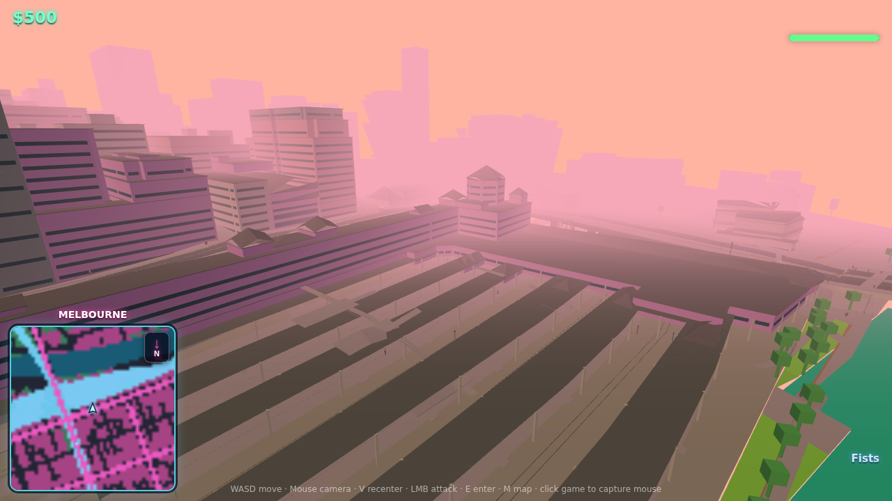
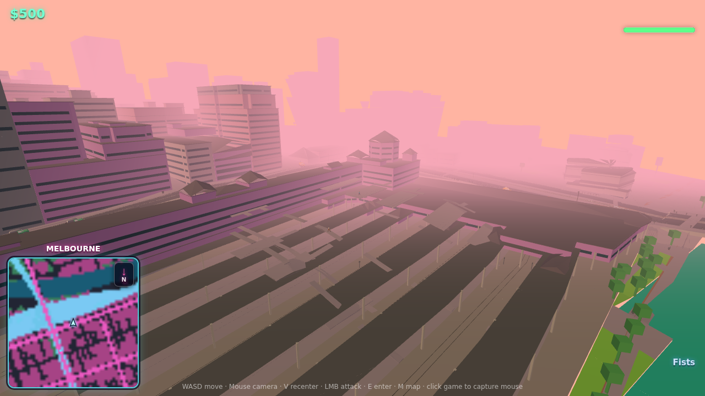
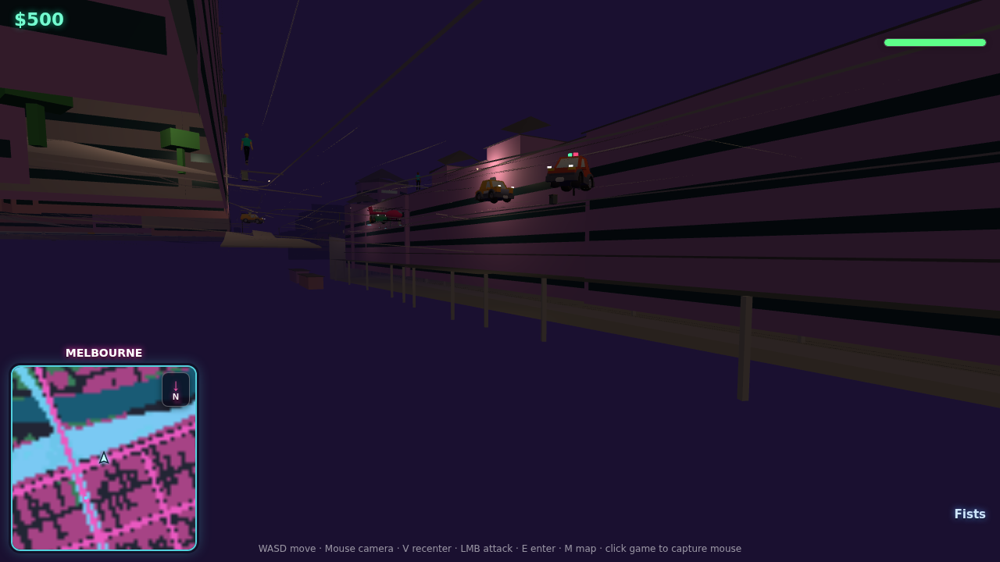

# Grade Separation: Decoupling Multi-Level Infrastructure from the Terrain Heightfield

All paths relative to the repo root. This plan resolves the recurring
underground-rail, bridge, and Flinders Street Station problems by fixing their
shared root cause instead of patching symptoms one commit at a time.

## 1. The root cause (why we keep fighting the same bug)

The terrain is a **single-valued heightfield**. `heightAt(x, z)` returns exactly
one ground elevation for every horizontal point — this is the core of
`docs/terrain-plan.md` and is baked into the corner lattice
(`scripts/map/terrain.mjs`, `compiled-recipes.mjs:createCompilerContext`).

Every symptom we keep hitting is the same impossibility: a single-valued
function cannot store two surfaces at one `(x, z)`. But each of these features
*requires* two or more stacked surfaces at the same footprint:

| Feature | Needs stacked at same (x,z) |
| --- | --- |
| Underground train | natural ground on top **+** track/tunnel floor below |
| Bridge / overpass | deck on top **+** road passing under |
| Flinders Street | concourse/entrance level **+** platforms below |
| "Layers chopped out of the earth" | this *is* the current workaround |

The `terrain-cutting` mechanism fakes "underground" by carving the shared
surface downward:

```js
// compiled-recipes.mjs (createCompilerContext)
const terrainHeightAt = (x, z) => cuttingProfileHeightAt(x, z) ?? naturalTerrainHeightAt(x, z);
```

`cuttingProfileHeightAt` returns the cutting's `floorY` inside its outline, so
the *actual ground* is replaced by a lower floor. That is literally "layers
being chopped out of the earth" — it is the only move a heightfield has, and it
deletes the ground that should remain above and beside the rail.

Flinders Street is the direct collision of this: the entrance sits above track
level, but the ground under it can only hold one height. We carve a trench for
the rail, then write regression tests to stop that trench from eating the road
and station on top — `scripts/map/compiled.test.mjs:503` ("committed cutting
never lowers Flinders Street or ordinary vehicle navigation", asserting
`flindersMinimumY >= 14`). That war is unwinnable at the seams, which is why
transitions and gradients crease: `railSurfaceHeightAt` stitches **four**
single-valued functions (`cuttingProfileHeightAt`, `tunnelSurfaceHeightAt`,
portal ramps, `bridgeSurfaceHeightAt`) together with `min`/`max` blends, and
min/max blends of independent surfaces always crack.

## 2. The design principle

> **The heightfield represents the natural ground, and nothing else.** Every
> grade-separated element — tunnels, underpasses, bridge decks, station
> platforms and concourses — is an independent structure (mesh + collider) with
> its own local floor and roof. A structure never edits `heightAt`. Rail and
> road run on **structure-owned surfaces**, not on carved terrain. Portals are
> the single, explicit point where a structure surface ramps to meet the ground.

We are already halfway there. This is not a rewrite.

## 3. Current-state audit — what already works vs. what fights the heightfield

**The right model already exists and ships.** Commit `f9731c2` ("Separate
bridge decks from terrain") gave us independent structures:

- **Bridges** — `transport-structure` with `roadDeck` emits a real deck prism at
  `topY` with its own collision mesh (`compiled-recipes.mjs:1437`). Decoupled.
- **Tunnels** — `transport-structure` `structure === 'tunnel' && roadDeck` emits
  a real box with walls **and a roof** (`compiled-recipes.mjs:1447`). Decoupled.
- **Station canopies** — `station-canopy` with `floorY`/`roofY`
  (`addStationCanopyGeometry`). Decoupled.
- **A real datum system** — `normalizeInfrastructureElevations(objectChunks,
  seaDatum)` in `scripts/map/terrain.mjs:369` converts source AHD elevations to
  game Y via `relativeAhd(v) = round((v - seaDatum) * 10) / 10`. Cuttings carry
  `floorAhd`; transport-structures carry `minAhd`/`maxAhd`; canopies carry
  `floorAhd`/`roofAhd`. **The elevation data to build proper multi-level
  structures already exists in the pipeline.**

**What still fights the heightfield:**

- **`terrain-cutting`** (`open-data.mjs:322`, `importReviewedTerrain`) — writes
  `floorY` that *replaces* terrain inside its outline via
  `cuttingProfileHeightAt`. This is the carve.
- **`terrain-portal`** (`open-data.mjs:354`) — ramps that only make sense
  relative to the carved floor.
- **Rail `nav-path` height** — trains sample `railSurfaceHeightAt(x, z,
  structure)`, the four-way min/max stitch.
- **`transit-stop` for trains** — samples the same stitched rail height, so
  platforms inherit the seams.

So the fix is not new machinery. It is **migrating rail and stations onto the
structure model bridges already use, and retiring the carve.**

## 4. Target data model

Introduce one new authored object kind and retire two:

**New: `rail-structure`** (mirrors `transport-structure`, but rail-aware). Fields:
- `structure`: `'open-cut' | 'tunnel' | 'viaduct'` (open trench with retaining
  walls / fully covered / elevated deck).
- `railBedY` — the running surface, from `floorAhd`/`deckAhd` via `relativeAhd`.
  This is what trains and platforms sit on. **Authoritative, single-valued along
  the corridor, never blended with terrain.**
- `roofY` (tunnels) / `parapetY` (open-cut walls) — independent upper surface.
- `outline` — corridor footprint, chunk-clipped like buildings/bridges already
  are in `addObject` (`open-data.mjs:266`).
- `portals: [{ side, approachLength, maxGrade }]` — where `railBedY` ramps to
  meet `naturalTerrainHeightAt` at each end.

**New: `station-platform`** — a `station-structure` group (extends the existing
`station-canopy` grouping in `open-data.mjs:844`). Carries independent
`platformY` (from track AHD) and `concourseY` (from street/entrance AHD). This is
what makes Flinders Street's "entrance above the tracks" representable at all:
two authored surfaces at the same footprint, zero terrain edits.

**Retire:** `terrain-cutting` (the carve) and `cuttingProfileHeightAt`'s
participation in `terrainHeightAt`. `terrain-portal` folds into
`rail-structure.portals`.

**Invariant to enforce with a test:** `terrainHeightAt(x, z) ===
naturalTerrainHeightAt(x, z)` for **all** `(x, z)`. Terrain is only terrain.

**Open cuts need a terrain *hole*, not a carve.** A subtlety confirmed during
Phase 1b: a covered tunnel keeps the ground whole and needs nothing from the
terrain mesh, but a *visible* trench (open-cut, or an uncovered platform) must
have a topological **hole** punched in the terrain render/collision mesh over
its footprint — otherwise the single-surface ground draws straight over the
trench and you cannot see or drop into it. This is distinct from the carve we
are removing: the heightfield (`heightAt`) stays at natural ground; only the
*mesh triangles* inside the outline are removed, and the structure's own bed
fills the void. The machinery already exists — `terrainCutters` +
`subtractTerrainCutters` — so open-cut `rail-structure` outlines simply join the
cutter list. Covered tunnels never become cutters.

## 5. Height resolution after the change

Collapse the four-way stitch into two independent, clean functions:

```js
// Ground: the natural heightfield, always. No structure ever perturbs it.
const terrainHeightAt = naturalTerrainHeightAt;

// Rail: the structure's own bed, ramped to ground only inside a portal.
function railBedHeightAt(x, z, structureId) {
  const s = railStructureFor(structureId);            // corridor lookup
  const portal = s.portalContaining(x, z);            // null unless near an end
  if (!portal) return s.railBedY(x, z);               // flat/graded bed, authoritative
  const d = portal.distanceInto(x, z);                // 0 at mouth
  return lerp(s.railBedY(x, z), naturalTerrainHeightAt(x, z),
              clamp(d / portal.approachLength, 0, 1)); // single, explicit transition
}
```

No `min`/`max` blends between independent surfaces anywhere on the corridor. The
only place bed and ground meet is one `lerp` inside one portal. Seamless
transitions become structural, not emergent.

## 6. Flinders Street as the reference implementation

Flinders Street is the acid test and should be the first corridor migrated.



*Baseline capture of the Flinders Street rail corridor before the migration
(headless runtime, 25/25 chunks, no Rapier errors).*


- Replace `data/map-overrides/flinders-street-cutting.geojson` `terrain-cutting`
  records with `rail-structure` (`structure: 'open-cut'` under the platforms,
  `'tunnel'` where the concourse decks over the tracks) + `station-platform`.
  The `floor_ahd`, `structure_id`, and canopy component metadata already present
  map directly onto the new fields — see `importReviewedTerrain`
  (`open-data.mjs:299`).
- The natural ground of Flinders Street (the road) **stays at its true
  elevation**, because nothing carves it. The `flindersMinimumY >= 14`
  regression test (`compiled.test.mjs:503`) stops being a defensive hack and
  becomes a natural consequence — with terrain untouched, there is nothing to
  lower it.
- The station entrance renders as an authored `concourseY` slab above the
  `platformY` bed. The "entrance above one level" problem disappears because the
  two levels are no longer competing for one heightfield value.

## 6b. Status — phases 0–3 implemented

Phases 0–3 are implemented and committed. The Flinders override is now a
`rail-structure` (open-cut) plus `rail-portal`s; the runtime terrain carve is
retired (`terrainHeightAt === naturalTerrainHeightAt` is an enforced test); the
committed spawn map was migrated to match and recompiles clean (54/54 map tests,
45/45 runtime, `tsc` clean, validator clean).

**Rebuild note.** The committed binary map was migrated in place (heights
un-carved from the reviewed pins, cutting/portal objects rewritten to
rail-structure/rail-portal) because a full `npm run map:build` needs networked
Overpass + Melbourne open-data that the CI sandbox cannot reach. The source
(`open-data.mjs` importer + the geojson override + the terrain bake) was updated
so a real rebuild reproduces the same result. One known follow-up: the two
station head-house components that used to be dragged down into the carve
(`804817:1145/1146`) keep their previously-baked bases in the committed map; a
real rebuild recomputes them from the now-natural ground, which ties into the
separate building base-elevation issue (§8b).



*After migration: the corridor renders on the rail-structure model with the
terrain carve retired — visually consistent with the baseline, no regression.*

**Phase 4 runtime verification (headless drive).** Dropped the player at points
around the station and read where physics settles — 0 Rapier errors:

| Location | Settled | Expected |
| --- | --- | --- |
| Beside the station building | ~18 m | natural ground (not the retired 3 m carve) |
| Flinders Street road | ~17 m | natural road level |
| Inside the platform trench | ~3 m | on the rail bed (open-cut hole catches you) |
| West approach | ~16 m | natural ground |

So at the physics level the ground now meets the buildings at natural height,
and the trench is a real, enterable open cut with a bed collider — not a carve,
not a bottomless hole.



*Ground level: the open-cut retaining wall (with guardrail) rises to road grade,
surface traffic runs above, and pedestrians stand on the intact ground beside
the station.*

## 8b. Separate issue — station building base elevations

Investigation surfaced a defect independent of the rail carve: the Flinders
head-house building components sit at base ~23–24 m while the natural ground
there is ~16 m, so the ground appears to drop away before the building instead
of meeting it. The cause is inflated `footprint_min_elevation` values in the
source building data (roof/upper-floor returns), not the terrain. Fixing it is a
building base-elevation correction in the build pipeline + a rebuild; it is
tracked separately from grade separation.

## 7. Phased implementation

Each phase is independently shippable and independently verifiable with the
`verify` skill.

### Phase 0 — Lock current behavior (no functional change)
- Add a golden test asserting the *current* Flinders bed/road heights so we can
  prove the migration preserves gameplay. Extend `compiled.test.mjs`.
- Add the target invariant test `terrainHeightAt === naturalTerrainHeightAt`,
  marked skipped/expected-fail, so Phase 3 flips it green.

### Phase 1 — `rail-structure` authoring + geometry (parallel to cuttings)
- Add `rail-structure` and `station-platform` to `open-data.mjs`
  (`importReviewedTerrain` + `addObject` chunk-clipping like bridges).
- Extend `normalizeInfrastructureElevations` (`terrain.mjs:369`) to resolve
  `railBedY`, `roofY`, `platformY`, `concourseY` from AHD.
- Add geometry recipes in `compiled-recipes.mjs` next to the bridge/tunnel
  blocks (`:1431`–`:1470`): open-cut = floor slab + retaining walls; tunnel =
  reuse the existing wall+roof box; viaduct = reuse the deck prism. Emit
  colliders into the existing `cuboids` / `collisionMeshes` capture arrays — no
  runtime/NBCH format change needed.
- Feature-flag it: build `rail-structure` geometry while `terrain-cutting` still
  drives height, so the two can be visually diffed on the same map.

### Phase 2 — Move rail + stations onto structure surfaces
- Point train `nav-path` height at `railBedHeightAt` (replace
  `railSurfaceHeightAt` in the `heightAt` selector, `compiled-recipes.mjs:1073`).
- Point train `transit-stop` height at `platformY` (`compiled-recipes.mjs:1513`).
- Implement portal ramps as the single `lerp` in §5; delete the portal-vs-cutting
  `min`/`max` logic (`railSurfaceHeightAt`, `:992`).

### Phase 3 — Retire the carve
- Remove `cuttingProfileHeightAt` from `terrainHeightAt`
  (`compiled-recipes.mjs:972`) → `terrainHeightAt = naturalTerrainHeightAt`.
- Flip the Phase 0 invariant test to required. Delete `terrain-cutting` /
  `terrain-portal` authoring and the defensive Flinders regression once the
  golden test in Phase 0 confirms parity.
- Rebuild the committed map; re-run `validate-compiled-map.mjs`.

### Phase 4 — Polish & generalize
- Migrate other grade-separated rail (City Loop portals, viaducts) to
  `rail-structure`.
- Tune retaining-wall thickness, portal `approachLength`/`maxGrade`, tunnel
  clearance (already clamped 3.6–6.5 m at `:1454`).
- Vehicle/camera checks: cars drive over the intact ground *above* covered rail;
  camera clamp already exists (`Viewports.ts`).

## 8. Why this is feasible (and bounded)

- **No physics-engine change.** Rapier already gives independent trimesh/cuboid
  colliders for the bridge and tunnel decks (`collisionMeshes`, `cuboids`
  capture arrays). Rail structures reuse the same path.
- **No runtime/NBCH format change.** Structures are already serialized as
  material-bucketed meshes plus collider arrays; `rail-structure` adds instances,
  not new record types on the wire.
- **The datum and source data already exist.** `relativeAhd`/`seaDatum` and the
  AHD fields on cuttings, structures, and canopies are in place today.
- **It deletes code.** The end state removes the four-way height stitch, the
  carve, and the defensive Flinders test — replacing them with one authoritative
  bed surface and one portal `lerp`.

The scope is a **data-model shift** (grade separation is a structure, not
terrain), not new engine capability. That is what makes the overall goal —
underground rail, real bridges, a multi-level Flinders Street with seamless
transitions — genuinely achievable.

## 9. Risks

- **Corridor lookup cost** — `railBedHeightAt` must find the owning structure per
  sample. Mitigate with the existing per-chunk object index (`objectIndex.chunks`)
  used by `bridgeSurfaceHeightAt` (`:975`); rail nav samples are already chunk-local.
- **Portal seam at the mouth** — the one remaining terrain/structure join. Keep it
  to a single `lerp` over `approachLength`; test grade continuity `≤ MAX_GRADE`
  (0.08) across the portal, reusing the Flinders grade assertion machinery.
- **Map data authoring** — Flinders `.geojson` must be re-authored to the new
  records. Bounded: same source metadata, remodeled fields. Golden test guards parity.
- **Visual double-cover during Phase 1** — mitigated by the feature flag; only one
  of cutting/structure renders per build.

## 10. Verification

- Per phase: `verify` skill (headless build + drive), plus `npm test`.
- Phase 1: visual diff cutting vs. structure on the same corridor.
- Phase 2: drive/ride the Flinders corridor — train on `platformY`, road on true
  ground above, no seam at the portal.
- Phase 3: invariant test green; `validate-compiled-map.mjs` clean; committed map
  rebuilt.
- Regression: the full grade matrix from `docs/terrain-plan.md` §Verification.
